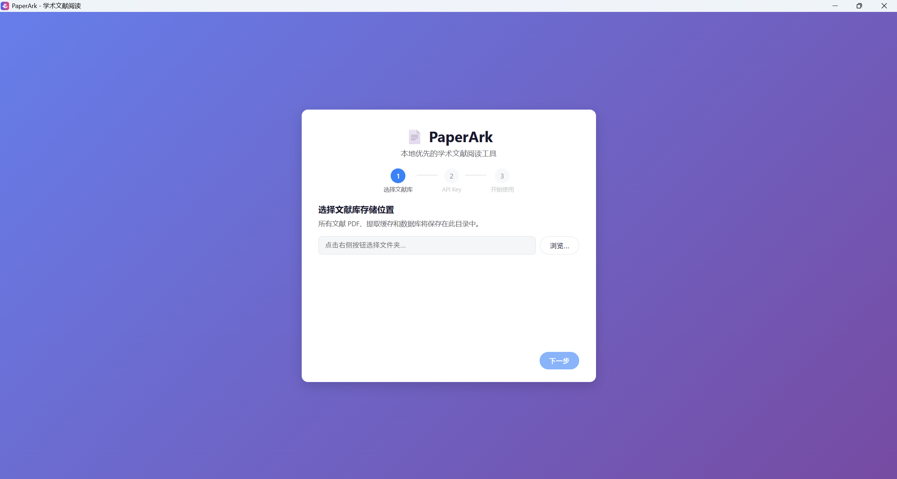
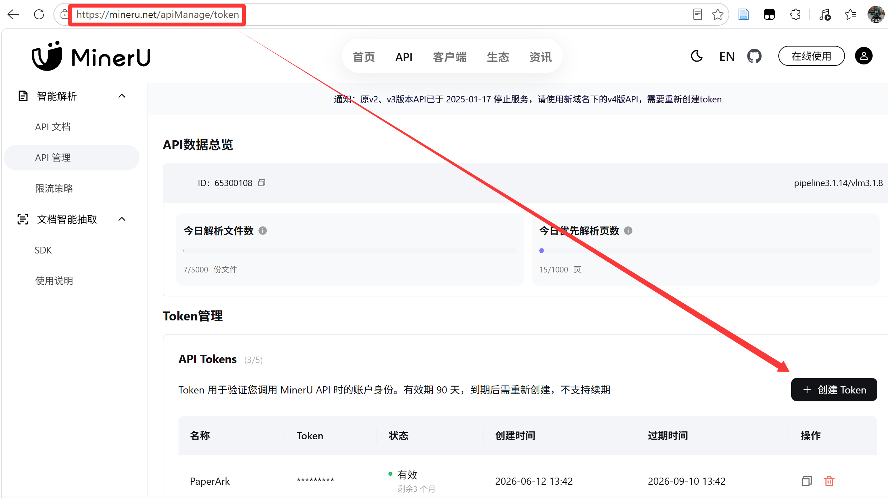
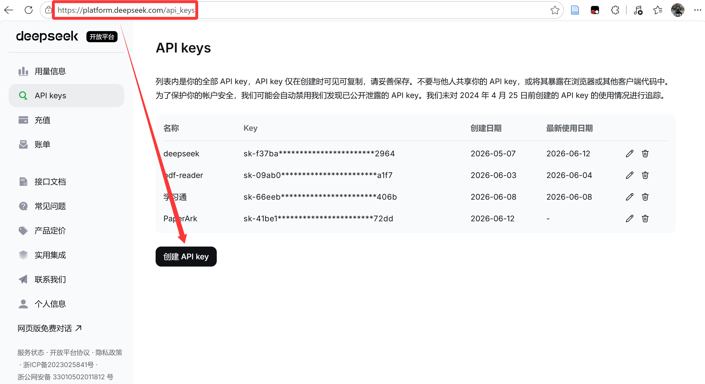
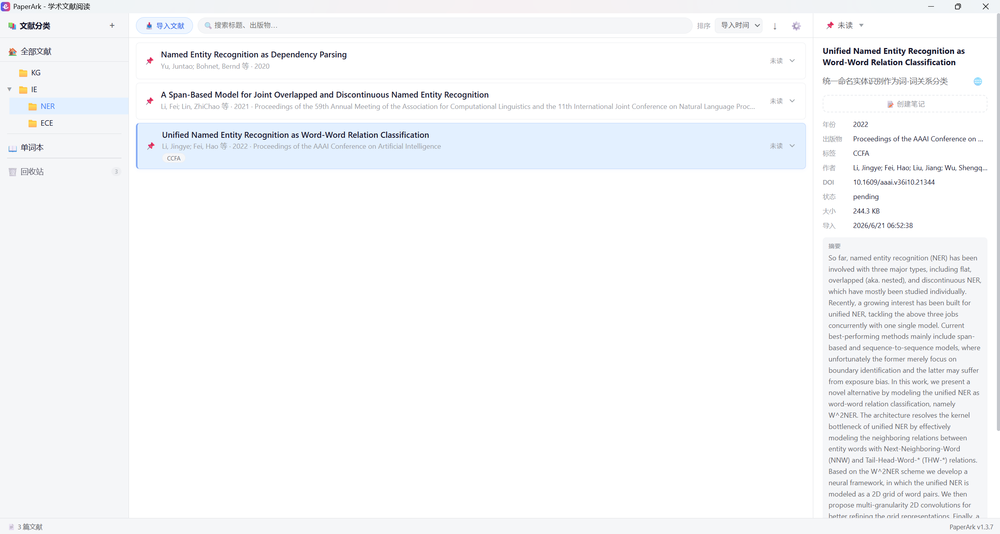
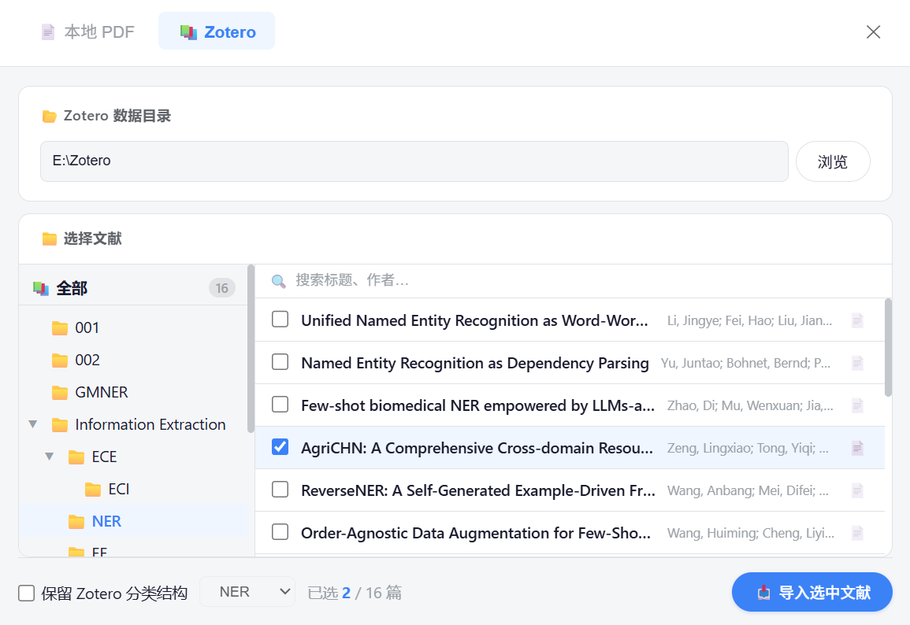
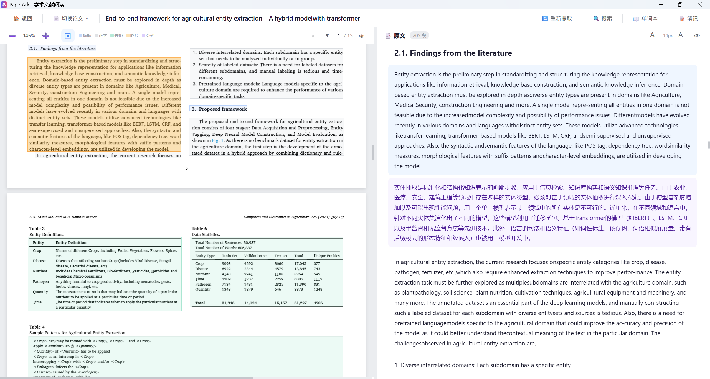
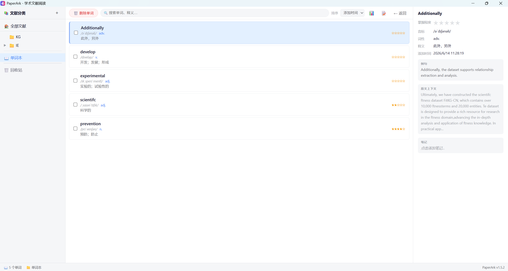
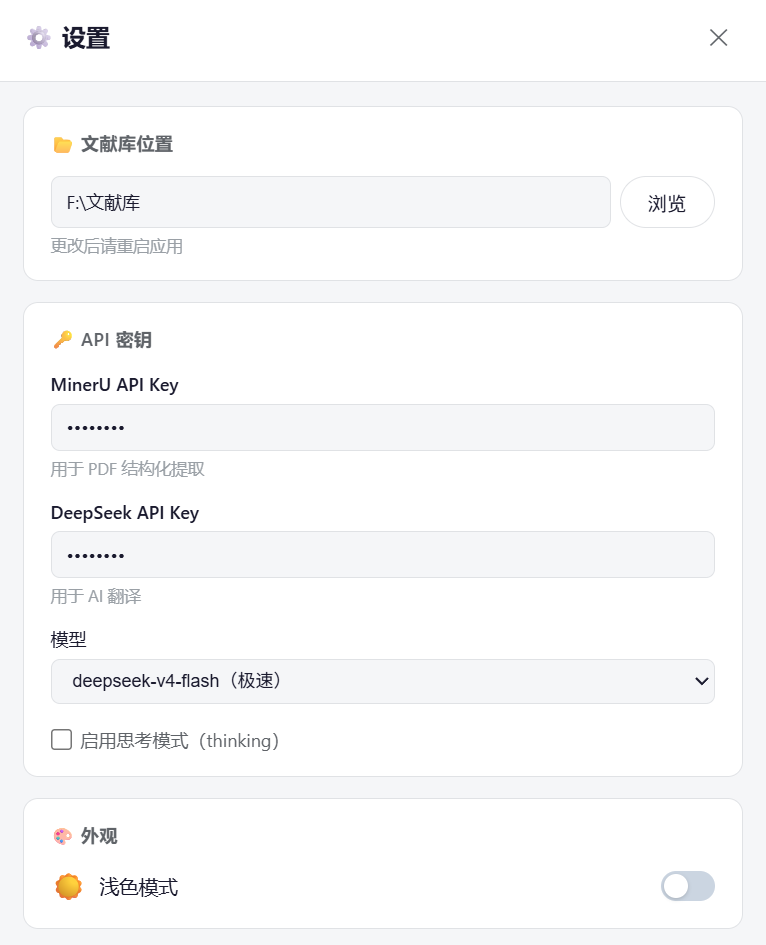

# PaperArk 使用说明

> AI 驱动的学术文献阅读工具

PaperArk 是一款面向学术研究者的桌面文献阅读工具，支持 PDF 导入、全文结构化提取、AI 段落翻译、标注与笔记、Markdown 笔记、单词本、暗色模式等功能，帮助你把论文从静态 PDF 变成可深度交互的知识。

🚀 **下载后直接双击 `paperark.exe` 启动，无需安装。**

---

## 目录

1. [首次启动配置](#1-首次启动配置)
2. [主界面概览](#2-主界面概览)
3. [文献管理](#3-文献管理)
4. [从 Zotero 导入文献](#4-从-zotero-导入文献)
5. [阅读论文](#5-阅读论文)
6. [全文搜索](#6-全文搜索)
7. [AI 翻译](#7-ai-翻译)
8. [标注与笔记](#8-标注与笔记)
9. [单词本](#9-单词本)
10. [暗色模式](#10-暗色模式)
11. [设置](#11-设置)
12. [回收站](#12-回收站)

---

## 1. 首次启动配置

首次运行 PaperArk 时，会弹出引导对话框，共三步。

### 步骤 1：选择本地文献库

选择一个文件夹作为文献库的存储位置。PaperArk 会把所有文献 PDF、提取缓存和数据库文件保存在此目录中。

点击 **浏览…** 选择一个空文件夹或已有文献库的文件夹，然后点击 **下一步**。

### 步骤 2：配置 API Key（可跳过）

PaperArk 依赖两个云端 AI 服务来提供核心能力：

| 服务 | 用途 | API Key 获取地址 |
|------|------|------------------|
| **MinerU** | PDF 全文结构化提取（段落、表格、公式） | [https://mineru.net/apiManage/token](https://mineru.net/apiManage/token) |
| **DeepSeek** | AI 段落翻译 | [https://platform.deepseek.com/api_keys](https://platform.deepseek.com/api_keys) |

在密码框中粘贴对应的 API Key。点击下方的蓝色链接可在浏览器中打开申请页面。

> 💡 两个 Key 均可跳过，后续在设置中补填。但没有 MinerU Key 将无法提取全文。

**如何获取 MinerU API Token：**

访问 [https://mineru.net/apiManage/token](https://mineru.net/apiManage/token)，登录后即可创建和管理 API Token。

**如何获取 DeepSeek API Key：**

访问 [https://platform.deepseek.com/api_keys](https://platform.deepseek.com/api_keys)，登录后点击创建 API Key。

### 步骤 3：开始使用

核对配置信息，点击 **开始使用 PaperArk** 进入主界面。

---

## 2. 主界面概览

主界面采用三栏布局：

- **左侧栏**：分类树、单词本入口、回收站入口。右键分类可新建子分类、重命名或删除
- **中间栏**：文献卡片列表，支持搜索、排序，点击选中，双击打开阅读视图
- **右侧栏**：选中文献的详细信息，可点击各字段直接编辑

---

## 3. 文献管理

### 导入文献

点击 **📥 导入文献** 按钮，选择一个或多个 PDF 文件即可导入。PaperArk 会自动：

- 将 PDF 复制到文献库的 `papers/` 目录
- 从文件名提取作者和标题（格式：`作者 - 标题.pdf`）
- 识别文件名中的年份

### 分类管理

右键左侧栏空白处 → **新建根级分类**，或右键已有分类 → **新建子分类**，支持无限层级嵌套。

将文献移动到分类：
- 右键文献卡片 → **移至分类 →** 选择目标分类
- 或拖拽文献卡片到左侧分类树上

### 搜索与排序

中间栏顶部工具栏支持：
- **搜索**：按标题、作者、出版物、关键词模糊匹配
- **排序**：按导入时间、标题、作者、年份、出版物排序，支持升序/降序切换

### 阅读状态

每篇文献可标记阅读状态：**未读** / **在读** / **已读**。在文献卡片右侧下拉菜单或详情面板顶部均可切换。

### 右键菜单

右键文献卡片可弹出菜单，支持以下操作：

- **移至分类**：将文献移动到指定分类，或从当前分类中移除
- **📂 打开文件目录**：用资源管理器打开该论文的文件夹，查看 PDF 原文及提取缓存
- **🗑️ 移至回收站**：删除文献（可恢复）

---

## 4. 从 Zotero 导入文献

如果你使用 [Zotero](https://www.zotero.org/) 管理文献，PaperArk 支持直接从 Zotero 数据库中批量导入文献及其 PDF、元数据和分类结构。

### 打开导入窗口

点击工具栏 **📥 导入文献** → 切换到 **📚 Zotero** 标签页。

### 自动检测数据目录

PaperArk 会自动检测 Zotero 数据目录的位置。如果未检测到，可手动点击 **浏览** 选择包含 `zotero.sqlite` 的文件夹。

### 选择文献

- **左侧分类树**：点击 Zotero 分类可筛选该分类及其子分类下的文献
- **📚 全部**：显示 Zotero 中所有带 PDF 的文献
- **搜索**：在顶部分类树上方输入关键词过滤
- **勾选**：勾选需要导入的文献（右键分类树可 **全选 / 取消全选**）

### 导入选项

- **保留 Zotero 分类结构**：勾选后，PaperArk 会自动创建与 Zotero 同名的分类并放入对应文献
- 取消勾选则可选择将文献统一导入到指定分类

### 导入内容

导入时 PaperArk 会自动读取：

| 信息 | 来源 |
|------|------|
| 标题 | Zotero 元数据 |
| 作者 | Zotero 作者列表（自动拼接为 `姓, 名`） |
| 年份 | Zotero `date` 字段 |
| 出版物 | Zotero 期刊/会议/书名 |
| DOI | Zotero DOI |
| 摘要 | Zotero `abstractNote` |
| PDF | Zotero storage 中的 PDF 文件（自动拷贝到 PaperArk 文献库） |

> 💡 导入自动按 DOI 去重，已存在的文献不会重复导入。

### 进度与结果

导入过程中显示实时进度条。完成后显示导入 / 跳过 / 失败的具体统计。

---

## 5. 阅读论文

双击文献卡片进入阅读视图，核心体验是 **PDF 与提取全文的左右联动**。

### PDF 浏览

左侧 PDF 面板支持：
- **缩放**：➖ / ➕ 按钮，范围 50% ~ 300%
- **翻页**：滚动浏览，也可用 ▲ ▼ 按钮逐页翻页
- **页码跳转**：点击当前页码数字 → 输入页码 → 回车跳转
- **段落边界框**：点击 ▣ 按钮切换显示，不同颜色区分标题/正文/表格/图片/公式

### 全文提取

首次打开论文时，如果没有提取过全文，顶部工具栏会显示 **🚀 提取全文** 按钮。

> ⚠️ 提示：提取需访问 MinerU 云端服务。如已开启系统代理或 VPN，建议先关闭，否则可能导致提取失败。

点击后 PaperArk 会：
1. 上传 PDF 到 MinerU 云端
2. 等待 AI 解析（通常 1–3 分钟）
3. 下载结构化结果（段落文本、表格 HTML、公式 LaTeX、图片）

提取完成后，右侧 **原文面板** 展示结构化全文，包括标题层级、正文段落、表格、公式和图片。

### 段落联动

**点击原文段落 → PDF 自动跳转到对应页面并高亮区域**，反之也可以在 PDF 上点击文字区域来定位对应段落。

原文面板工具栏支持：
- **字体缩放**：A⁻ / A⁺ 调整阅读字号
- **隐藏/显示 PDF**：仅看原文，或恢复双栏

---

## 6. 全文搜索

在阅读界面按 **Ctrl+F**（或点击工具栏 🔍 按钮），弹出搜索框：

- 输入关键词 → 所有匹配段落**实时高亮**
- **Enter** → 下一个匹配，**Shift+Enter** → 上一个
- PDF 自动跳转到对应页面
- 匹配计数显示当前结果位置
- **Escape** 或点击 ✕ 关闭搜索

---

## 7. AI 翻译

### 段落翻译

右键任意段落 → **🌐 翻译此段落**，DeepSeek 会流式输出中文译文，实时显示在段落下方。

- 翻译结果**自动缓存**，同段落再次点击秒加载
- 右键译文可**复制译文**或**删除译文**（重新翻译）

### 标题翻译

在右侧详情面板的中文标题旁，点击 **🌐** 按钮即可 AI 翻译英文标题。

---

## 8. 标注与笔记

### 文本标注

在原文中**选中文字**，弹出浮动工具栏：

- **🖊 高亮**：用彩色背景标记选中文字
- **U̲ 下划线**：用彩色下划线标记
- **📖 单词本**：将选中单词添加到单词本

支持 6 种标注颜色。点击已有标注可**改色**、**切换高亮/下划线**或**删除**。

### 笔记（Markdown 编辑器）

在右侧详情面板点击 **📝 查看 / 编辑笔记** 进入笔记编辑区，或在阅读界面点击顶部工具栏 **📝 笔记** 打开浮动笔记面板。

笔记支持 **Markdown 格式**，配备格式化工具栏：

| 功能 | 操作 |
|------|------|
| 标题 | 下拉选择正文 / H1 ~ H6 |
| 加粗 | 选中文字后点击 **B**，再点取消 |
| 斜体 | 选中文字后点击 **I** |
| 删除线 | 选中文字后点击 **~** |
| 行内代码 | 选中文字后点击 **`</>`** |
| 无序列表 | 点击 **•** 行首插入 `-` |
| 有序列表 | 点击 **1.** 行首插入 `1.` |
| 链接 | 点击 **🔗** 插入 `[文字](url)` |
| 代码块 | 点击 **▤** 插入多行代码块 |

- **实时预览**：编辑区上方写 Markdown 源文，下方即时渲染显示
- **自动保存**：失焦自动写入磁盘
- 支持 GFM 扩展语法（表格、任务列表等）

阅读界面中的 **📝 笔记** 浮动面板与详情页笔记**共享同一份数据**，在任意一侧编辑都会同步。

---

## 9. 单词本

### 添加单词

在阅读原文时选中英文单词 → 点击 **📖 单词本**，PaperArk 会自动查询该单词的音标、词性、释义和例句，确认后存入单词本。

### 管理单词

- 主界面左侧栏点击 **📖 单词本** 进入单词列表
- 支持搜索、按字母/时间/掌握程度排序
- 点击单词查看详情，可编辑所有字段
- 用 ★ 评分标记掌握程度（1–5 星）
- 支持**批量删除**（勾选后点击删除）
- 支持**导出为 CSV / Markdown**

在阅读视图内也有悬浮单词面板，仅显示当前论文的单词，点击 📍 可跳转到单词所在的上下文段落。

---

## 10. 暗色模式

PaperArk 支持浅色 / 深色模式切换：

- 打开 **⚙️ 设置** → 外观 → 点击 **☀️ 浅色模式 / 🌙 深色模式** 切换
- 切换即时生效，**OS 标题栏颜色同步变化**
- 重启后自动记忆上次主题

---

## 11. 设置

点击主界面工具栏的 **⚙️** 按钮打开设置。

### 文献库位置

显示当前文献库路径。如需迁移到新位置，选择新路径后可选择：
- **安全复制**：复制全部数据到新位置，旧文件保留
- **剪切移动**：迁移后删除旧目录文件

### MinerU API Key

用于 PDF 全文结构化提取。在 [https://mineru.net/apiManage/token](https://mineru.net/apiManage/token) 获取。

### DeepSeek API Key

用于 AI 段落翻译。在 [https://platform.deepseek.com/api_keys](https://platform.deepseek.com/api_keys) 获取。

### 模型设置

- **模型**：下拉选择 `deepseek-v4-flash`（极速）或 `deepseek-v4-pro`（专业）
- **启用思考模式**：开启后翻译质量更高，但速度稍慢

### 外观

切换浅色 / 深色主题。

> 💡 所有设置（API Key 除外）**自动保存**，修改后即时生效。

---

## 12. 回收站

删除的文献会进入回收站，不会立即从磁盘中移除。

- 点击左侧栏 **🗑️ 回收站** 查看已删除文献
- 右键文献可 **恢复** 或 **彻底删除**
- 点击 **清空回收站** 批量永久删除

> ⚠️ 彻底删除会同时清除 PDF 原文和提取缓存，不可恢复。
